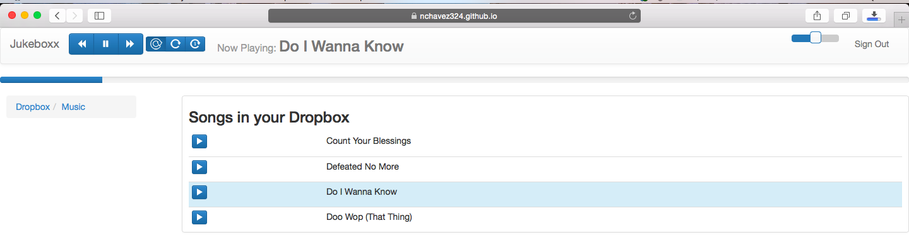

Jukeboxx
========

Plays and streams music from your Dropbox, using the [Dropbox Core API](https://www.dropbox.com/developers/core), and [SoundManager](http://www.schillmania.com/projects/soundmanager2/)

Use the web app [here](https://nchavez324.github.io/Jukeboxx/app/)!
Works on Firefox, Chrome and Safari!

Make sure to have music in your Dropbox to test :)

Here's a Dropbox test account in case you don't have any music in yours:

Email: jukeboxx.test@gmail.com
Pass : JukeboxxTestPassword

Screenshot:

